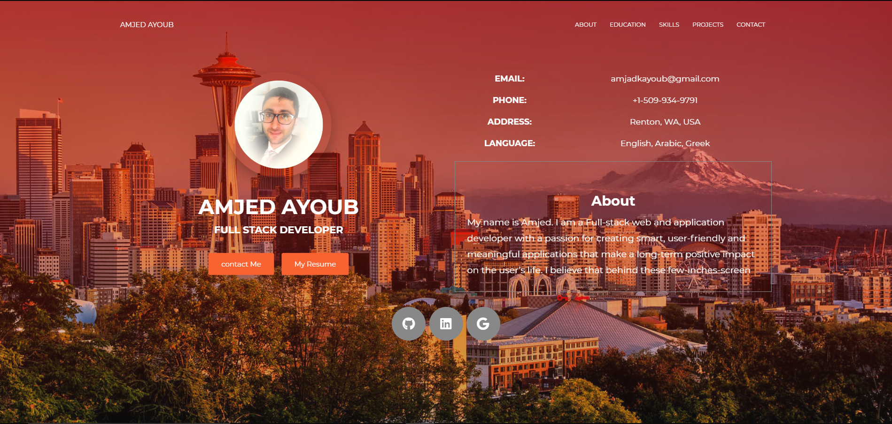
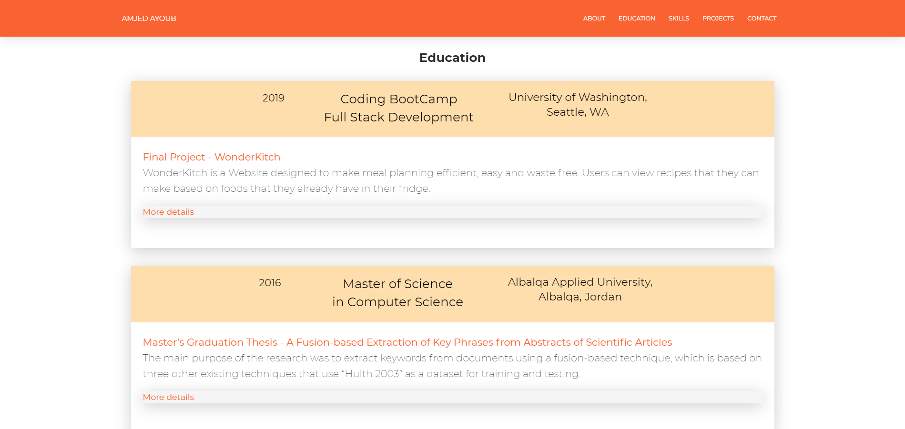
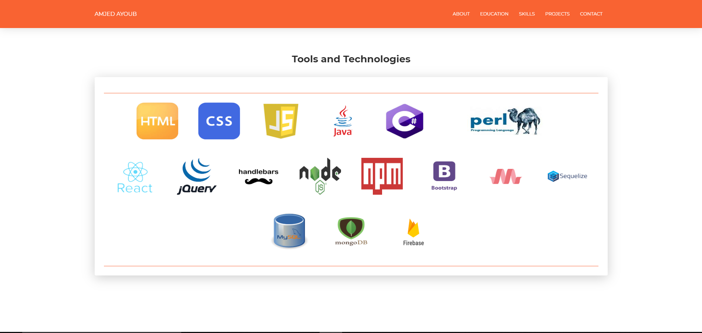
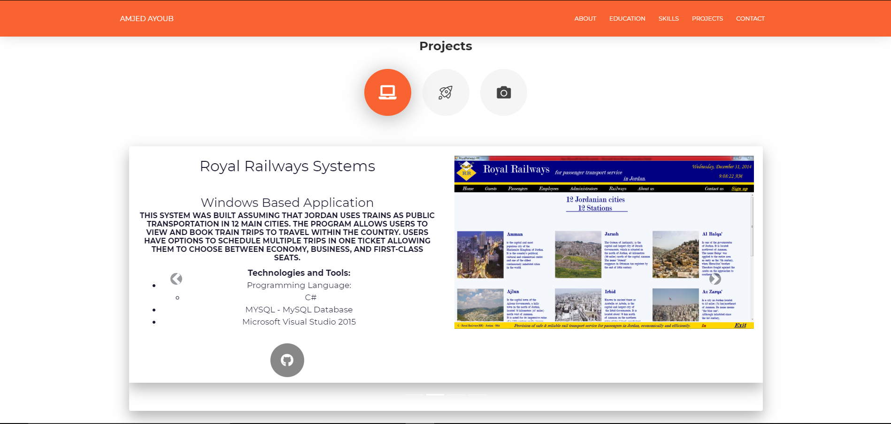
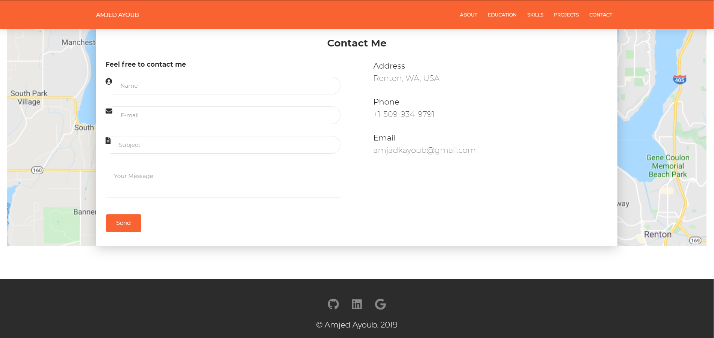
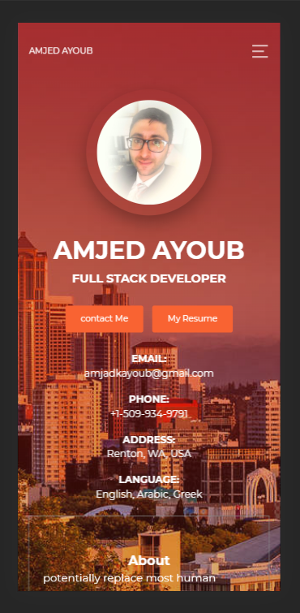
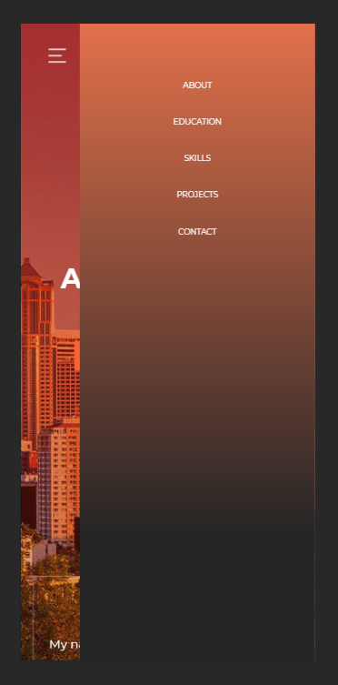
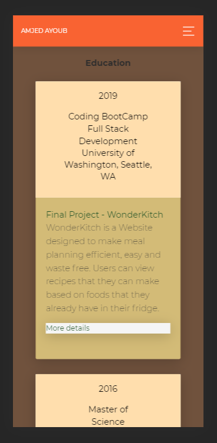
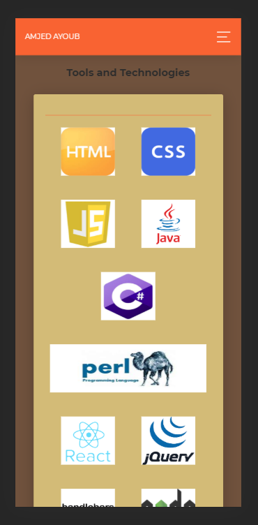
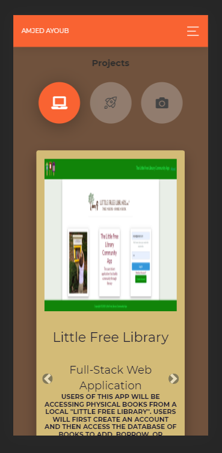

# Amjed Ayoub Portfolio

## Overview
Portfolio, skills and experience. This is a modern and responsive design built with HTML template, CSS, Bootstrap 4, Now UI Kit and Font-Awesome.
This project is a professional portfolio site using HTML template, CSS, Bootstrap 4, Now UI Kit and Font-Awesome, enhanced with a ***mobile-responsive*** layout. The site has five sections:
* "About" which includes a paragraph about the author
* "Education" that shows the education levels with final projects
* "Skills"
* "Projects" shows recent projects and some images.
* "Contact" includes a contact form.

## Getting Started
These instructions will get you a copy of the project up and running on your local machine.

### Installing
Git clone the repository to your local machine:

HTTPS:
```
https://github.com/AmjedAyoub/portfolio.git
```
SSH:
```
git@github.com:AmjedAyoub/portfolio.git
```

## Screen-shots

### About Section


### Education Section


### Skills Section


### Projects Section


### Contact Section


## Mobile responsivity







## Technologies & Tools
* HTML  
* CSS
* JavaScript
* Bootstrap 4
* Now UI Kit, [read more](./README-now-ui-kit.md)
* Font-Awesome

## Links
This application is deployed on Heroku, [Try it yourself](https://amjedayoub.herokuapp.com/).\
This application is deployed on GitHub Pages, [Try it yourself](https://amjedayoub.github.io/portfolio/).\
This application is published on [GitHub](https://github.com/AmjedAyoub/portfolio).

## Authors
See contribution history [here](https://github.com/AmjedAyoub/portfolio/graphs/contributors).